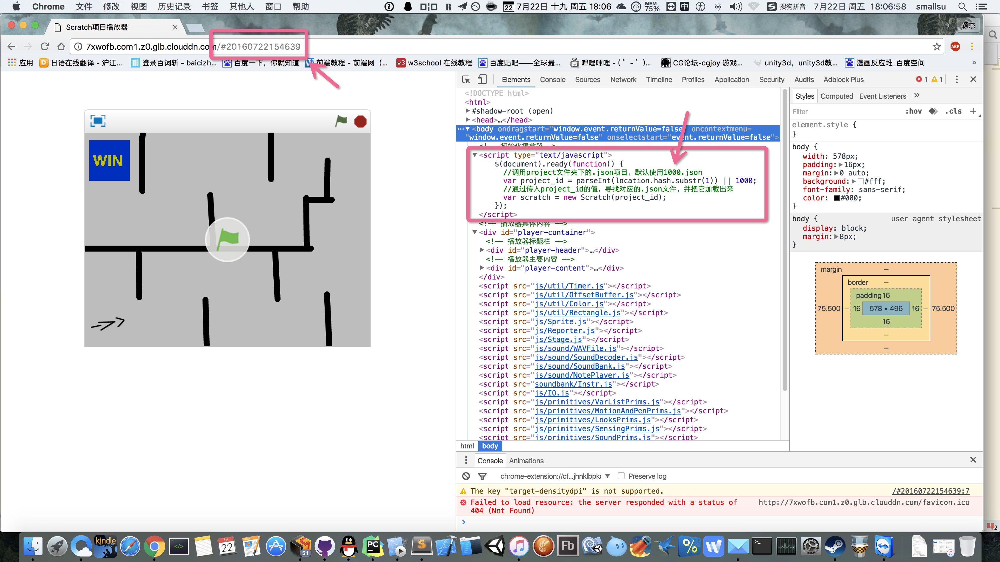

# Scratch-Project-Player-Static-Local-Relationship-With-HTML5

自己改造Scratch官方Html5版本播放器的代码，做到本地依赖化，不需要配置任何Node.js环境和外网环境，能直接加载和打开本地的.sb2文件。特别适合七牛云等静态云存储使用，示例为七牛云存储中打开Scratch的html播放器，其中七牛云空间设置index.html为主入口。默认访问1000.json工程文件。即index.html#1000。。然后我提供了另外一个工程20160722154639.json，即访问index.html#20160722154639可以直接打开该工程。具体提取工程的python脚本我也放在自己的github里面，有兴趣的请移步下载使用。

#关于这个

1.使用方法

首先在jQuery里面调用Scratch(),传入的值即为项目的id值，对应放在Project文件夹下的json文件。

默认使用1000.json 如果需要使用另外的项目请使用 #号来引用。

```
<!-- 初始化播放器-->
<script type="text/javascript">
	$(document).ready(function() {
		//调用project文件夹下的.json项目，默认使用1000.json
		var project_id = parseInt(location.hash.substr(1)) || 1000;
		//通过传入project_id的值，寻找对应的.json文件，并把它加载出来
		var scratch = new Scratch(project_id);
	});
</script>
```

然后在需要显示Scratch播放器的位置显示对应内容。

```
<!-- 播放器具体内容 -->
<div id="player-container">

		<!-- 播放器标题栏 -->
		<div id="player-header">
				<div id="player-header-preload"></div>
				<div id="player-header-version"></div>
				<button id="toggle-fullscreen" tabindex="1"></button>
				<button id="trigger-stop" tabindex="3"></button>
				<button id="trigger-green-flag" tabindex="2"></button>
		</div>
		
		<!-- 播放器主要内容 -->
		<div id="player-content">
				<div id="container"></div>
				<div id="overlay"></div>
				<div id="preloader">
						<div id="preloader-progress"><div id="preloader-progress-bar"></div></div>
						<div id="preloader-caption">正在加载中，请稍后&hellip;</div>
						<div id="preloader-details"></div>
				</div>
		</div>
		
</div>
```

相关使用图例


